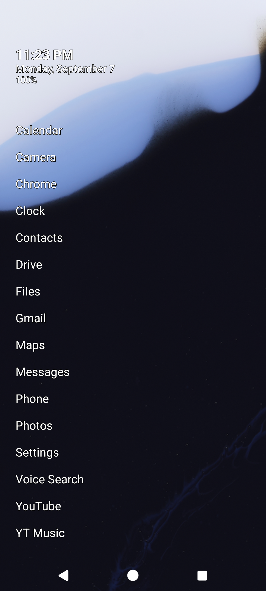

# konmin

konmin is a minimal home-screen launcher for Android. The home screen is a stack of small text widgets at the top and a plain list of your apps below. No icons, no buttons, no clutter. Your wallpaper shows through the whole screen.

## Install

konmin is not on an app store. You install it directly.

**Obtainium (easiest, auto-updates):** install [Obtainium](https://github.com/ImranR98/Obtainium), then Add App with this URL: `https://github.com/konsumer/konmin`. It installs the latest APK and keeps it updated.

**Manual:** download `app-debug.apk` from the [latest release](https://github.com/konsumer/konmin/releases/latest), open the file, allow installing from that source, and tap Install.

First launch: press the Home button, pick konmin, and tap Always. konmin becomes your default launcher.

## Uninstall

Uninstall it like any other app. Open Settings, then Apps, then konmin, then Uninstall. Or long-press the konmin icon on your current home screen, choose App info, then Uninstall.

## Basic use

- Widgets live above the app list. Clock, date, battery, weather, and calendar agenda ship as examples. Each widget refreshes on its own schedule.
- Settings: long-press the widget area, or tap the gear icon beside the search field. The option named open settings with decides which of these works.
- Widgets: turn each one on or off, change the order, and adjust its height. Add your own plugin with add plugin (.js). Plugins you added can be removed; the bundled examples can only be disabled.
- Apps: hide the apps you never use, pick the sort order, and turn the search box on or off.
- Theme: text and background colours, text size, an optional accent colour from your wallpaper, an optional text glow, and hiding the status bar.

## Widgets

The widgets are small JavaScript plugins. Clock, date, battery, weather, and agenda come with the app as working examples. You can add your own plugin files too. See PLUGIN.md for how plugins work and how to write one.

## Building from source

konmin is open source. See DEVELOPER.md to build it yourself.
